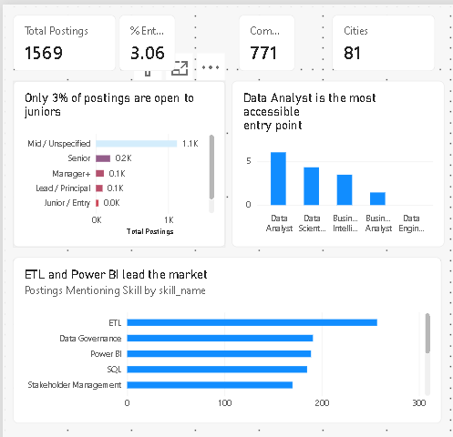
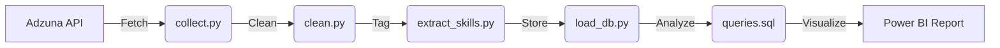

# Job Market Intelligence Dashboard

### Where are the data roles, and what do they actually ask for?

An end-to-end data pipeline that collects, cleans, and analyzes **2,588 job postings** from the Adzuna API to answer the most pressing questions for junior data professionals: *How open is the market, and which skills actually matter?*

Built with Python, SQL, and Power BI.



---

## 🚀 Key Findings

**1. The "Junior" Barrier**
The market is highly competitive. Out of **2,588 raw postings**, only a small fraction are explicitly open to junior/intern candidates. This dashboard helps you identify exactly which roles (e.g., Data Analyst vs. Data Engineer) offer the best entry points.

**2. Role-Specific Skill Profiles**
The market confirms that "Data Roles" are not one-size-fits-all. Our analysis reveals signature tools for each career path:

| Role Family | Signature Skill |
|---|---|
| **Data Engineer** | ETL |
| **Business Intelligence** | Power BI |
| **Data Scientist** | Machine Learning |
| **Data Analyst** | SQL |

**3. Geographic & Corporate Concentration**
The data shows significant clusters in specific cities and a high dependency on a few major employers. This dashboard helps you pinpoint where to focus your job-hunting efforts.

---

## 📊 The Dashboard Experience

*   **Page 1: Breaking In**
    *   Headline KPIs (Total postings, seniority distribution, company diversity).
    *   Entry-level opportunities by role family.
    *   Top 10 most in-demand skills overall.

*   **Page 2: The Skill Matrix**
    *   A deep-dive visualization mapping roles to their required technologies.
    *   Regional hiring trends and top hiring companies.

---

## 🛠 Project Architecture



### Pipeline Details
1.  **Fetch:** Aggregates live postings (API).
2.  **Clean:** Normalizes company names, locations, and classifies seniority.
3.  **Tag:** Uses a 44-skill taxonomy with custom regex extraction.
4.  **Analyze:** Performs SQL-based analysis to determine skill reach and hiring trends.

---

## 💻 How to Run It Yourself

### Prerequisites
*   Python 3.x
*   [Free Adzuna API Key](https://developer.adzuna.com/)

### Steps
1. **Clone the repository:**
   ```bash
   git clone <your-repo-url>
   cd job-market-intelligence
   ```
2. **Setup environment:**
   ```bash
   python -m venv .venv
   source .venv/bin/activate  # Windows: .venv\Scripts\activate
   pip install -r requirements.txt
   ```
3. **Configure:**
   *   Copy `.env.example` to `.env` and add your Adzuna API key.
4. **Execute pipeline:**
   ```bash
   python collect.py
   python clean.py
   python extract_skills.py
   python load_db.py
   python analyze.py
   ```
5. **Visualize:**
   *   Open `dashboard/job_market_dashboard.pbix` in Power BI Desktop. It connects directly to the processed CSV exports in `data/exports/`.

---

## ⚠️ Caveats & Insights
*   **API Limits:** Postings are truncated; counts represent "mentioned in posting" (a reliable signal for comparison, not an absolute demand count).
*   **Survivorship Bias:** Posting volume trends include expired listings; the dashboard focuses on fresh hiring data.
*   **Salary Data:** Excluded due to low reporting rates (6–7% of listings), ensuring the dashboard relies only on high-confidence data.

---

## Tech Stack
Python (`pandas`, `requests`) · SQL (`SQLite`) · Power BI (`DAX`) · Git
