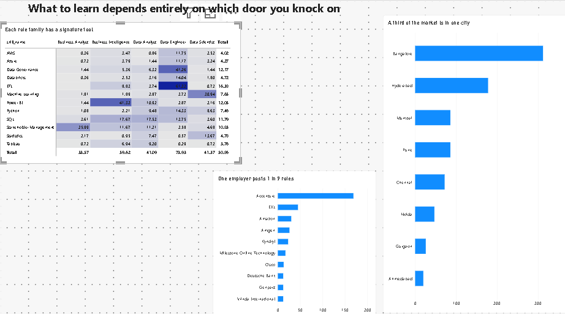

# Job Market Intelligence

### Where are India's entry-level data roles — and what do they actually ask for?

An end-to-end pipeline that pulls **1,569 live data-job postings** from the Adzuna API,
cleans and structures them into a SQLite database, extracts the skills each posting
mentions, and turns the result into a two-page Power BI dashboard built to answer two
questions a job-seeker actually has: *how open is this market to juniors, and which
skills matter for which role?*

Built with Python, SQL, and Power BI.


---

## Key findings

**The market is almost closed to juniors.** Only **3.1%** of the 1,569 postings
(48 roles) are open to junior or intern candidates. The overwhelming majority target
mid-level or unspecified-seniority hires. Among the entry-level roles that do exist,
**Data Analyst is the most accessible door** (6.0% of its postings are junior) and
**Data Engineer is the least** (0.0%).

**The five role families are not interchangeable — each has a signature tool.** This is
the payoff of the second page:

| Role family | Signature skill | Mentioned in |
|---|---|---|
| Data Engineer | ETL | **61.3%** of its postings |
| Business Intelligence | Power BI | **41.3%** |
| Data Scientist | Machine Learning | **30.9%** |
| Business Analyst | Stakeholder Management | **26.0%** |
| Data Analyst | SQL | **17.5%** |

ETL appears in 61.3% of Data Engineer postings but just 0.7% of Data Scientist ones — an
~87× difference in a single row. Applying to "data roles" generically wastes effort; the
titles reward different skills.

**The market is geographically and institutionally concentrated.** Bangalore alone is
**31.3%** of every posting that names a city (312 of them), and a single employer —
**Accenture — posts 1 in 9 roles** (169, 10.8%). One company's hiring cycle visibly moves
this entire dataset.



---

## The dashboard

**Page 1 — Breaking In:** headline KPIs (1,569 postings, 3.1% entry-level, 771 companies,
81 cities), the seniority mix, entry-level share by role, and the ten most-mentioned
skills overall.

**Page 2 — What To Learn:** the role × skill matrix (the centrepiece), plus where the jobs
are (top cities) and who is hiring (top employers).

The matrix doubles as a **validity check on the skill extraction**: if the matching logic
were broken, skills would scatter randomly across roles. Instead every skill lands in the
role you'd predict — ETL under Data Engineer, Power BI under BI, ML under Data Scientist.
That is the answer to "how do you know your parsing worked?"

---

## Architecture

```
Adzuna API → collect.py → clean.py → extract_skills.py → load_db.py → analyze.py → Power BI
              (fetch)     (clean)     (skill tagging)     (SQLite)     (SQL)        (dashboard)
```

| Stage | Script | What happens |
|---|---|---|
| Fetch | `collect.py` | Pull postings across role queries from the Adzuna API (key kept in `.env`) |
| Clean | `clean.py` | Deduplicate, normalise company/location text, classify seniority, keep a 90-day window |
| Tag | `extract_skills.py` + `skill_taxonomy.py` | Regex skill extraction over a 44-skill taxonomy with word-boundary matching |
| Store | `load_db.py` | Build the SQLite DB, 7 analysis views, and the Power BI export CSVs |
| Analyze | `analyze.py` + `queries.sql` | Run the SQL behind every chart and print the findings |
| Visualise | `job_market_dashboard.pbix` | Two-page Power BI report (DAX measures for entry-level share, skill reach, etc.) |

**Result:** 2,588 raw postings → **1,569** clean postings (24 May – 23 Aug 2026),
**44** skills, **2,191** job–skill pairs, skill coverage **56%**.

---

## Run it yourself

```bash
cd data
python -m venv .venv && source .venv/bin/activate   # or .venv\Scripts\activate on Windows
pip install -r requirements.txt
cp .env.example .env          # then add your free Adzuna API key
python collect.py             # 1 · fetch
python clean.py               # 2 · clean
python extract_skills.py      # 3 · tag skills
python load_db.py             # 4 · build DB + exports
python analyze.py             # 5 · print findings
```

Then open `dashboard/job_market_dashboard.pbix` in Power BI Desktop. It reads the two CSVs
in `data/exports/`, so no database driver is needed.

Get a free API key at [developer.adzuna.com](https://developer.adzuna.com/).

---

## Honest caveats

These are disclosed on purpose — knowing the limits of the data is part of the analysis.

- **Adzuna truncates descriptions to ~500 characters,** so skill counts capture what a
  posting mentions *first*, not everything it requires. Absolute percentages therefore
  **understate** true demand — the reliable signal is the *comparison between roles*, not
  the raw level. Charts are labelled "mentioned in posting", never "required".
- **Weekly posting volume is not plotted.** It appears to rise steeply over the window,
  but that is survivorship bias — expired listings drop out of the API — not a hiring
  surge. Showing it would be misleading.
- **Salary is excluded from the main analysis.** Only 6–7% of postings report a figure, so
  any average would describe a small, self-selected set of employers.
- **Skill extraction is regex over a fixed taxonomy,** not NLP. Single-letter matches (like
  "R") are constrained to language contexts to avoid false positives such as requisition
  IDs (`R-801324`).

---

## Tech stack

Python (`requests`, `pandas`, `python-dotenv`) · SQLite · SQL · Power BI · DAX
